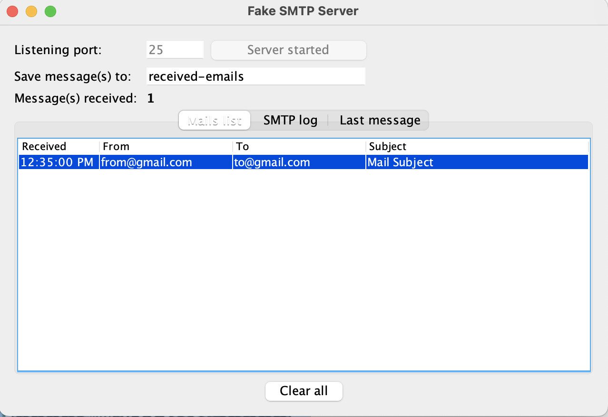

## Java Email using SMTP

#### Steps to run:

* Download the FakeSMTP jar from [here](http://nilhcem.com/FakeSMTP/download.html)
* Run the server: `java -jar ~/Downloads/fakeSMTP-2.0.jar`
* Start the server via the GUI
* Run the EmailService.java class and use the FakeSMTP GUI to debug

